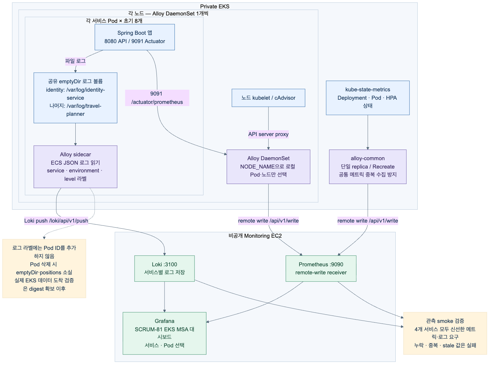

# TravelPlanner — 여행 일정 협업 플랫폼

지도에서 장소를 찾고, 날짜별 일정을 짜고, 동행자를 초대해 함께 편집하고, 완성된 일정을 커뮤니티에 공유하는 서비스입니다.
KT Cloud Tech Up(KDT) 심화 프로젝트로, **모놀리스 → EKS → 4개 서비스 MSA → Argo CD GitOps**까지 전환하며 각 단계를 실제 AWS에서 측정했습니다.

<p align="center"></p>

## 레포 구성

| 레포 | 역할 | 스택 |
|---|---|---|
| [travel-gitops](https://github.com/KDT-TravelPlanner/travel-gitops) | **시작점.** Terraform(VPC·EKS·RDS·ElastiCache·Bastion), Kustomize 매니페스트, Argo CD app-of-apps, 배포·검증 스크립트 | Terraform, Kustomize, Argo CD 3.5 |
| [identity-service](https://github.com/KDT-TravelPlanner/identity-service) | OAuth(Google/Naver) 로그인, JWT 발급·갱신(refresh family), 사용자 | Kotlin 1.9 · Spring Boot 3.5 |
| [travel-service](https://github.com/KDT-TravelPlanner/travel-service) | 여행·일정·동행자 권한, 순서 변경 Bulk UPDATE, 경로 최적화 | Kotlin · Spring Boot |
| [community-service](https://github.com/KDT-TravelPlanner/community-service) | 게시글·댓글, 일정 공유 | Kotlin · Spring Boot |
| [maps-service](https://github.com/KDT-TravelPlanner/maps-service) | 국가·도시, Google Places 검색·경로 | Kotlin · Spring Boot |
| [travel-common](https://github.com/KDT-TravelPlanner/travel-common) | 서비스 간 HTTP 어댑터, JWT 전달, X-Request-Id 로깅 공통 라이브러리 | Kotlin |
| [travel-frontend](https://github.com/KDT-TravelPlanner/travel-frontend) | 웹 프론트엔드, S3 + CloudFront 정적 배포 | Next.js 16 · React 19 · zustand |

## MSA 구조

서비스 경계는 "함께 바뀌는 규칙"과 데이터 소유권으로 나눴습니다. 서비스 간에는 코드 참조 대신 HTTP만 오가며, 호출 서비스가 JWT와 `X-Request-Id`를 그대로 전달해 권한과 로그 추적이 이어집니다. 의존 서비스가 내려가면 성공으로 위장하지 않고 503을 반환합니다(강제 장애 4/4 확인).

```
Community → Identity (작성자 요약)     Community → Travel (여행 접근 권한)
Travel    → Identity                   Travel    → Maps (장소·경로)
Identity  → Travel (회원 탈퇴 정리)
```

- 각 서비스는 같은 RDS(PostgreSQL 17)의 **독립 스키마**(identity / travel / community / location)를 쓰고, identity·maps만 Redis(TLS)를 씁니다.
- Pod마다 앱 컨테이너 + Alloy 로그 sidecar. 노드별 Alloy DaemonSet과 kube-state-metrics가 Prometheus/Loki로 보내고 Grafana에서 서비스·Pod별 요청·오류·p95·JVM·HPA를 봅니다.
- HPA: identity 1–4, 나머지 2–4, 앱 컨테이너 CPU 60% 기준. Cluster Autoscaler로 노드 2–4(t3.large).

<p align="center"></p>

## 배포 파이프라인 (GitOps)

```
서비스 레포 main 머지
  → GitHub Actions: 테스트·빌드 → ECR에 immutable digest publish
  → 공용 workflow(update-gitops.yml)가 GitHub App으로 travel-gitops에 digest PR 생성
  → 사람이 PR 머지 (배포 승인 지점)
  → Argo CD 자동 sync (prune + selfHeal) → 해당 서비스만 rollout
```

- Git(main)이 클러스터의 단일 기준. Argo CD app-of-apps: `platform-dev-eks`(ALB Controller, metrics-server, Cluster Autoscaler) → `workload-dev-eks`(monitoring + 4개 서비스 + ALB Ingress).
- 비밀값은 AWS Secrets Manager → Kubernetes Secret으로만 흐르고 Git에는 없습니다. Git에는 VPC·SG·엔드포인트 같은 식별자만 커밋하며 CI가 placeholder 잔존을 검사합니다.
- EKS API는 비공개이고 운영자는 SSM Bastion을 통해서만 접속합니다.

## 검증 결과

### 1. 모놀리스: EC2 ASG vs EKS (t3.medium 2대, 16 RPS)
정상 부하에서는 차이가 작았습니다(p95 17.25 ms vs 17.62 ms). 복구 시험은 헬스체크 실패·실패 버전 롤백 두 경우만 양쪽 모두 통과했고, 전체 복구 시간은 EKS가 짧았지만(418 s vs 636 s) 복구 시작 이후 시간은 일관된 우위가 없었습니다.

### 2. EC2 모놀리스 vs EKS MSA (t3.large 2→4대, 사용자 작업 단위)
| 시험 | EC2 ASG | EKS MSA |
|---|---|---|
| 5분 기준 통과 최고 부하 | 18 작업/초 | **68 작업/초** (노드 2→4 확장) |
| 급증(16→32/초, 2분) 성공률 | 23.7 % | **100 %** (p99 0.49 s) |
| 1시간 지속 | 59/60분 통과 | 59/60분 통과 |
| 서버 1대 종료 후 10분 실패 | 0회 | 228회 |

#### 노드 확장과 초당 요청 수 (EKS MSA, Cluster Autoscaler 자연 확장)
| 단계 | 2→3 노드 | 3→4 노드 |
|---|---|---|
| Pod 스케줄 실패 감지 → Autoscaler 요청 | +10초 | +10초 |
| → **새 노드 클러스터 등록** | **+40초** | **+39초** |
| → 그 노드의 첫 Pod Ready | +2분 48초 | +21분 (스트레스 구간 앱 기동 실패 반복) |
| → 첫 정상 요청 처리 | +3분 32초 | – |

노드 확장 자체는 약 40초이고, 나머지는 JVM 앱 기동(약 2분)과 프로브·ALB 등록 시간입니다.

| 사용자 작업/초 | HTTP req/s | p95 | 실패율 |
|---|---|---|---|
| 16 | 92–107 | 44–56 ms | 0 % |
| 32 | 178–209 | 60–110 ms | 0 % |
| 64 | 353–376 | 78 ms–1.8 s | 0 % |
| **68** (5분 SLO 통과 최고) | **395–402** | 110 ms | 0 % |
| 80 | 456 | 3.6 s | 0 % |
| 96 | 422–428 | 15 s 타임아웃 | 6–9 % |
| 128 | 290 | 15 s | 38.6 % |

사용자 작업 1회 ≈ HTTP 요청 6개. 80 작업/초 이상에서는 처리량이 늘지 않고 p95가 초 단위로 튀기 시작해, 68이 SLO를 지키는 상한이었습니다.

"더 높은 부하를 처리했다"와 "모든 면에서 낫다"는 다른 결론이라, 노드 장애 대응은 남은 과제로 기록했습니다.

### 3. Argo CD GitOps 수락 테스트 (dev EKS, 2026-09-14/15)
| 항목 | 방법 | 결과 |
|---|---|---|
| 한 서비스만 배포 | community digest PR 머지 | community만 rollout, 나머지 3개 revision 유지, API 정상 |
| 설정 되돌리기 | kubectl로 CPU request 변경 | selfHeal이 **8초** 내 Git 값으로 복귀 |
| 이전 버전 복구 | PR revert 머지 | 137초 후 이전 digest 적용, 252초에 rollout 완료 |
| 부하 중 확장 | k6 5→60 req/s 7분 | 18,288건 실패 0, p95 61 ms, community Pod 2→4 |
| **CI → GitOps 전 구간** | 4개 서비스 main 머지 | 머지→봇 PR 4.8~6.5분, PR 머지→Argo 감지 39~282초, rollout 완료 153~380초. **4/4 성공** |

운영에서 배운 것: db.t4g.micro RDS는 연결이 약 70~80개라 Hikari pool을 서비스당 5로 캡해야 새 Pod가 뜬다 · Argo CD는 Git에 없는 필드 추가는 drift로 보지 않는다 · Deployment replicas는 `ignoreDifferences`로 HPA에 맡긴다 · 정리할 때는 Argo Application을 먼저 지워야 selfHeal이 Ingress를 되살리지 않는다.

## 문서
- 발표 자료·시연 영상: 아래 링크 (준비 중)
- 배포·검증 절차: [travel-gitops/argocd/README.md](https://github.com/KDT-TravelPlanner/travel-gitops/blob/main/argocd/README.md), [scripts/eks/README.md](https://github.com/KDT-TravelPlanner/travel-gitops/blob/main/scripts/eks/README.md)

> 2026-09 기준 서비스는 종료됐고 AWS 리소스는 정리된 상태입니다. 이 조직은 기록과 포트폴리오 목적으로 공개돼 있습니다.
